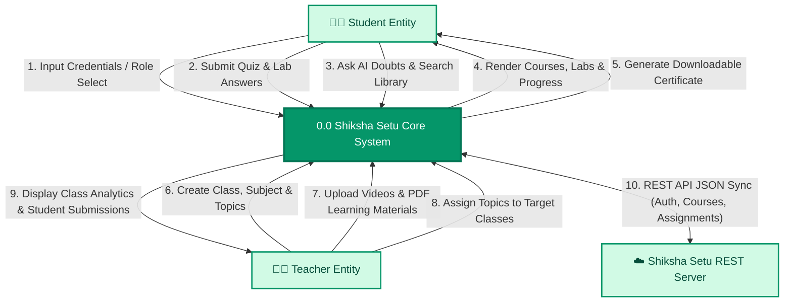
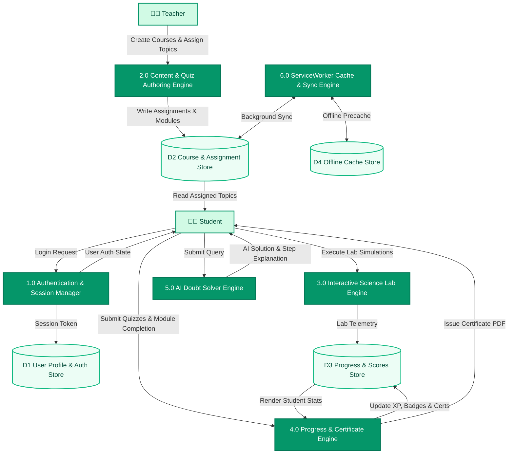
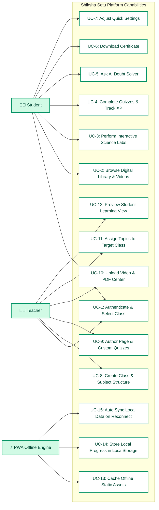
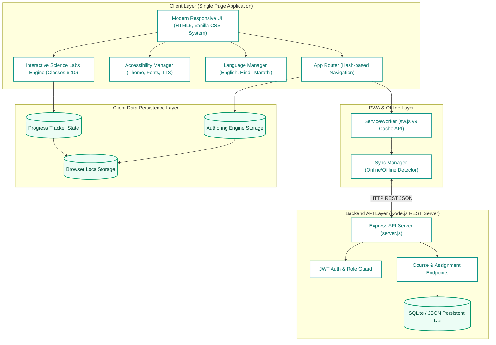
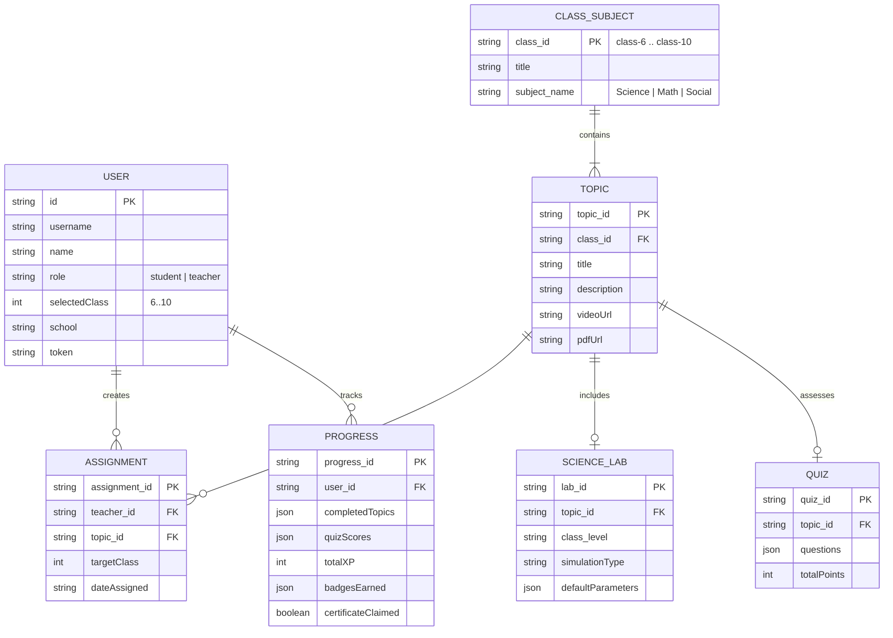
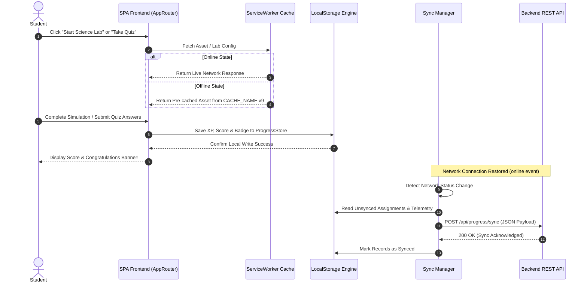
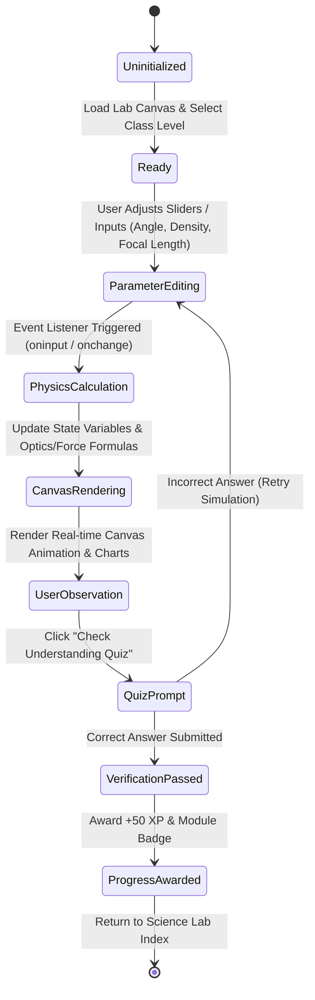

# 🏛️ Shiksha Setu - System Architecture & Comprehensive Diagrams Report

> **Platform**: Shiksha Setu - Government School E-Learning Portal (Classes 6–10)  
> **Repository**: [https://github.com/beingkunth-source/govt](https://github.com/beingkunth-source/govt)  
> **Live Web Application**: [https://govt-pi.vercel.app/](https://govt-pi.vercel.app/)

---

## 📋 Table of Contents
1. [Executive Summary](#-executive-summary)
2. [Data Flow Diagrams (DFD)](#-data-flow-diagrams-dfd)
   - [DFD Level 0 (Context Diagram)](#dfd-level-0-context-diagram)
   - [DFD Level 1 (Subsystem Functions)](#dfd-level-1-subsystem-functions)
3. [Use Case Diagrams](#-use-case-diagrams)
4. [System Architecture Diagram](#-system-architecture-diagram)
5. [Entity Relationship (ER) & Data Model Diagram](#-entity-relationship-er--data-model-diagram)
6. [Sequence Diagram: Offline Sync & PWA Cache](#-sequence-diagram-offline-sync--pwa-cache)
7. [State Machine Diagram: Interactive Science Lab Lifecycle](#-state-machine-diagram-interactive-science-lab-lifecycle)
8. [Module & Security Breakdown](#-module--security-breakdown)

---

## 💡 Executive Summary

**Shiksha Setu** is an accessible, offline-first E-Learning Single Page Web Application (SPA) designed specifically for Indian Government School students in Classes 6 through 10. Built with zero heavy external runtime dependencies, the platform provides seamless offline learning, interactive HTML5/Canvas science simulations, teacher assignment propagation, AI doubt solving, progress tracking, downloadable certificates, and multi-language support (English, Hindi, Marathi).

---

## 🔄 Data Flow Diagrams (DFD)

### DFD Level 0 (Context Diagram)

The Level 0 Data Flow Diagram illustrates the boundaries of the Shiksha Setu System, showing how external entities (Student, Teacher, Offline PWA Engine, and Cloud Server) interact with the core system.

---

### DFD Level 1 (Subsystem Functions)

The Level 1 Data Flow Diagram decomposes Process 0.0 into major functional sub-processes and client-side data stores.

---

## 🎯 Use Case Diagrams

The Use Case Diagram displays all actor interactions across Student, Teacher, and System background roles.

---

## 🏗️ System Architecture Diagram

The multi-tier system architecture highlights the decoupled SPA client layer, PWA cache engine, Local Data Store, and Node.js REST API layer.

---

## 📊 Entity Relationship (ER) & Data Model Diagram

The ER Diagram defines data entities, fields, keys, and relational cardinalities supporting local persistence and server sync.

---

## ⚡ Sequence Diagram: Offline Sync & PWA Cache

Demonstrates how user interactions function seamlessly offline and sync immediately upon reconnecting to the network.

---

## 🔬 State Machine Diagram: Interactive Science Lab Lifecycle

Shows the operational states and transitions of the 13 interactive HTML5 Science Lab simulations.

---

## 🔐 Module & Security Breakdown

| Module Name | File Location | Key Responsibilities & Capabilities |
| :--- | :--- | :--- |
| **App Router** | `js/app.js` | SPA hash router (`#dashboard`, `#teacher`, `#lab`, etc.), route protection, Quick Settings drawer control. |
| **Interactive Science Labs** | `js/modules.js` | 13 Class 6–10 interactive simulations (Optics, Density, Friction, Photosynthesis, Sound Waves, Circuits). |
| **Authoring Engine** | `js/builder.js` | Topic authoring, quiz creation, PDF/Video assignment to target classes, assignment event propagation. |
| **Progress Tracker** | `js/progress.js` | LocalStorage state tracking, XP scoring, badge unlocking, and certificate PDF generation. |
| **Accessibility Manager** | `js/accessibility.js` | Theme toggling (Dark/Light), text font scaling (`font-sm`..`font-xl`), high contrast, and SpeechSynthesis TTS. |
| **ServiceWorker** | `sw.js` | Cache-first / Network-first PWA caching strategy with auto cache purging (`shiksha-setu-cache-v9`). |
| **Backend REST Server** | `server.js` | Node.js Express server providing authentication, course persistence, and assignment sync APIs. |

---

> **Report Generated**: October 2026  
> **Status**: Fully Tested & Verified  
> **Repository**: [github.com/beingkunth-source/govt](https://github.com/beingkunth-source/govt)
